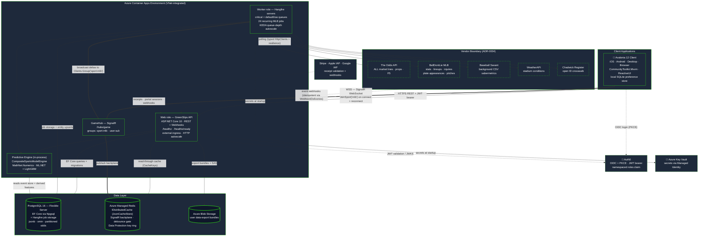

# GreenSlips: Predictive Sports Analytics Platform

GreenSlips is a commercial, cross-platform sports analytics and prediction engine. It ingests real-time market and statistical data from a set of specialised vendors, runs it through an in-process predictive engine, and delivers low-latency betting insights through a single Avalonia client that targets iOS, Android, desktop, and the browser from one codebase.

> **Project Status & Roadmap Note:**
> The architecture documented in this repository reflects the **MLB prediction engine**: the platform's active product line, built to production readiness ahead of a commercial App Store launch that has not yet taken place. The **NBA vertical from the original capstone build has been detached and archived**: no NBA ingestion or model jobs are registered, and its API surfaces resolve to dormant placeholder services. The sport-keyed seams (the `Sport` discriminator, `ISportProvider`, and the SignalR `sport:{key}` group convention) were deliberately left intact in the main tree, so reattaching NBA is a re-registration rather than a rebuild.

---

## Walkthrough

https://www.youtube.com/watch?v=jQ7mQY8EFqI

*Note: this recording predates the MLB rebuild and shows the earlier NBA capstone client. A walkthrough of the current Avalonia MLB build is pending.*

---

## System Architecture

The Avalonia client authenticates against Auth0 (OIDC + PKCE) and talks to the ASP.NET Core 10 API over two channels: HTTPS REST for slate, player, and market data, and a persistent SignalR WebSocket to `GameHub` at `/hubs/game` for live pushes. SignalR is backed by a Redis backplane (channel prefix `greenslips-sr`), so broadcasts fan out correctly across replicas. The same container image boots in one of two roles selected at runtime by the `GREENSLIPS_ROLE` variable: the **web** role serves controllers and holds the WebSocket connections, while the **worker** role owns the Hangfire servers and the recurring ingestion and model jobs. Splitting the roles is what stops every web replica from independently running the recurring-job scheduler; worker-side jobs still publish to SignalR groups through the Redis backplane, so a broadcast raised on the worker reaches clients connected to the web replicas. Group naming is centralised in `HubGroups` — `sport:{name}` for pipeline broadcasts (see ADR-0003) and `user:{sub}` for per-user preference and entitlement sync.

Data comes from four vendors with **hard, non-overlapping ownership boundaries** (ADR-0004): The Odds API owns every market line, BallDontLie MLB owns statistics, lineups and injuries, Baseball Savant supplies the sabermetrics BallDontLie does not expose, and WeatherAPI supplies stadium conditions. Crossing a boundary is prohibited even where a vendor technically exposes the data, so every value has single-source provenance. Each vendor has a defined degradation path, so a single outage produces a partial-but-usable page rather than a failed one.

---

## AI & Machine Learning Pipeline

The predictive engine **runs in-process in C#** behind an `ISportsModelEngine` seam (ADR-0006). There is no Python service, no inference sidecar, and no cross-language call at request time; the numerical work is implemented on `MathNet.Numerics`, with `ML.NET` and `LightGBM` supplying the gradient-boosted components. Where a model genuinely needs a library with no .NET equivalent, the decision of record is to train offline and export to ONNX for in-process inference rather than to stand up a second runtime.

The pipeline is a nightly chain of idempotent Hangfire jobs on Eastern time, each stage depending on the one before it: results settle, then event-level plate-appearance and pitch data is ingested, then derived features are rebuilt from that event store, then rolling as-of windows extend forward, then the previous day's predictions are graded, and finally the slate is projected at a fixed pre-game capture point. Every stage is upsert-keyed, so a re-run repairs rather than duplicates, and a gap left by vendor downtime is swept up by a daily coverage catch-up pass.

Output is assembled by a **composite engine**: a baseline projection is folded through a series of independently flag-gated contributors, each owning one slice of the output contract. With every flag off the engine returns the baseline verbatim, which makes enabling the real engine a dark launch and lets each model family go live on its own schedule without touching the consumers. Model probabilities are de-vigged against the market, converted to an edge and expected value, graded, and persisted as signals the client reads.

*Technique classes are named below; proprietary weightings, tuning constants, fitted coefficients, and measured performance are omitted. See [`ml-pipeline/features.md`](ml-pipeline/features.md).*

```mermaid
flowchart LR
    classDef default fill:#1E293B,stroke:#39FF14,color:#FFFFFF
    classDef datastore fill:#0F172A,stroke:#39FF14,stroke-width:2px,color:#FFFFFF
    classDef boundary fill:#1E293B,stroke:#39FF14,color:#FFFFFF

    subgraph INGEST["1 · Vendor Ingestion"]
        TOA["The Odds API<br/>macro lines · props<br/>self-rescheduling cadence ladder"]
        BDL["BallDontLie MLB<br/>plate appearances · pitches<br/>lineups · splits · injuries"]
        SAV["Baseball Savant<br/>off-peak CSV feeds"]
        WX["WeatherAPI<br/>game-time + forecast capture"]
    end

    subgraph XWALK["2 · Identity Resolution"]
        CH["Chadwick Register ingest"]
        RES["Deterministic name + DOB<br/>resolution & tiebreak"]
        MAP[("PlayerIdMapping ·<br/>PlayerIdMatch")]
    end

    STORE[("Event Store<br/>MlbPlateAppearances · MlbPitches<br/>MarketLines · PropRows<br/>MlbPlayerBoxScores · GameOutcomes")]

    subgraph FEAT["3 · Derived Feature Rebuild"]
        BASE["League rate baselines"]
        ARS["Pitcher arsenal<br/>velocity & movement"]
        CHASE["Batter chase profiles"]
        DECAY["Pitcher velocity decay"]
        ROLL["Rolling as-of windows<br/>30 / 90 / 365-day"]
    end

    subgraph MODEL["4 · Model Fits (offline, scheduled)"]
        HOOK["Starter-hook hazard fit<br/>weekly walk-forward"]
        PA["PA-outcome classifier<br/>gradient-boosted, walk-forward"]
        CALIB["Calibration fits<br/>isotonic · beta"]
    end

    subgraph ENGINE["5 · In-Process Engine (.NET)"]
        SIM["Markov-chain + Monte Carlo<br/>game & prop simulation"]
        LOG5["log5 matchup rates<br/>Bayesian shrinkage"]
        COP["Gaussian copula<br/>correlation & parlay pricing"]
        COMP["CompositeSportsModelEngine<br/>flag-gated contributor fold"]
    end

    subgraph EDGE["6 · Edge & Delivery"]
        DEVIG["De-vig strategy<br/>(Shin · power · proportional)"]
        EDGEENG["EdgeEngine<br/>edge % · EV · grade · conviction"]
        SIGNALS[("EdgeSignals ·<br/>TrendSignals ·<br/>DailyInferencePredictions")]
        GRADE["Next-day grading<br/>vs settled labels"]
        BT["Walk-forward backtest<br/>+ closing-line comparison"]
    end

    TOA --> STORE
    BDL --> STORE
    SAV --> STORE
    WX --> STORE
    CH --> RES --> MAP
    MAP --> STORE

    STORE --> BASE --> ROLL
    STORE --> ARS --> ROLL
    STORE --> CHASE --> ROLL
    STORE --> DECAY --> ROLL

    ROLL --> HOOK
    ROLL --> PA
    ROLL --> LOG5
    HOOK --> SIM
    PA --> SIM
    LOG5 --> SIM
    SIM --> COMP
    COP --> COMP
    COMP --> DEVIG --> EDGEENG --> SIGNALS
    CALIB --> COMP
    SIGNALS --> GRADE
    GRADE --> BT
    BT --> CALIB

    class STORE,MAP,SIGNALS datastore
    class INGEST,XWALK,FEAT,MODEL,ENGINE,EDGE boundary

```

---

## Database Design Principles

The schema is **denormalised for read-heavy slate queries** and split along a deliberate line. Inside an aggregate, a prop and its prices and hit-rate cells, a plate appearance and its pitches, a lineup and its batting-order entries, relationships are **real foreign keys with cascade delete**, because those children have no meaning without their parent and must be reclaimed with it. Across aggregate boundaries, tables are correlated through **shared vendor identifiers** (`PlayerId`, `TeamId`, `GameId`) with **no enforced constraint**, so an ingest job can write facts about a player before that player's row exists and a late-arriving vendor payload never fails on ordering. Those logical joins are held together by composite **unique indexes**, roughly fifty across the schema, which double as the natural upsert keys that make every ingestion job idempotent.

Player identity is reconciled rather than assumed: `PlayerIdMapping` and `PlayerIdMatch` crosswalk vendor player ids against the open Chadwick register by deterministic name and date-of-birth matching, and unresolved identities land in a review queue instead of being silently dropped. Every multi-sport table carries a `Sport` discriminator (its EF default is still `Nba` from the original build; MLB rows set it explicitly), and hot tables use PostgreSQL's `xmin` system column as an optimistic-concurrency token so competing pollers cannot clobber one another. Market history is retained through supersession rather than mutation, a moved line marks the prior row stale instead of overwriting it, with a global query filter making live-only the default read, and the raw odds-snapshot table is **range-partitioned by capture time** with partitions pre-created on a maintenance schedule.

```mermaid
erDiagram
    Games ||--|| MlbGameDetails : "FK · 1:1 game context"
    Games ||--o{ MlbPlateAppearances : "GameId (logical)"
    Games ||--o{ MarketLines : "GameId (logical)"
    Games ||--o{ PropRows : "GameId (logical)"
    Games ||--o{ ExpectedLineups : "GameId (logical)"
    Games ||--o{ EdgeSignals : "GameId (logical)"
    Games ||--o{ GameOutcomes : "GameId (logical)"
    Games ||--o{ OddsSnapshots : "GameId (logical, partitioned)"

    MlbPlateAppearances ||--o{ MlbPitches : "FK · cascade delete"
    PropRows ||--o{ PropPrices : "FK · cascade delete"
    PropRows ||--o{ PropHitRates : "FK · cascade delete"
    ExpectedLineups ||--o{ LineupEntries : "FK · cascade delete"

    PlayerIdMappings ||--o| PlayerIdMatches : "BdlPlayerId (logical)"
    ChadwickRegister ||--o{ PlayerIdMatches : "MlbamId (logical)"
    PlayerIdMappings ||--o{ PropRows : "PlayerId (logical)"
    PlayerIdMappings ||--o{ PlayerRollingWindows : "PlayerId (logical)"
    PlayerIdMappings ||--o{ MlbPlayerBoxScores : "PlayerId (logical)"

    PropRows ||--o{ EdgeSignals : "PropRowId (nullable)"
    EdgeSignals ||--o{ TrendSignals : "GameId + market (logical)"
    DailyInferenceRuns ||--o{ DailyInferencePredictions : "RunId (logical)"

    Games {
        bigint Id PK "vendor-assigned, never generated"
        enum Sport "discriminator"
        date GameDate "indexed"
        int Season "check constraint"
        int HomeTeamId
        int VisitorTeamId
        int HomeTeamScore
        int VisitorTeamScore
        string OddsApiEventId "indexed, market-vendor crosswalk"
        string Status
    }

    MlbGameDetails {
        bigint GameId PK "FK to Games"
        int ProbableHomePitcherId
        int ProbableAwayPitcherId
        string VenueName
        jsonb WeatherSummary
    }

    MlbPlateAppearances {
        bigint Id PK
        bigint GameId UK "natural key with PaNumber"
        int PaNumber UK
        date GameDate "indexed"
        int Season
        int Inning
        string HalfInning
        int BatterId "vendor id"
        int PitcherId "vendor id"
        char BatterSide
        char PitcherHand
        int Outs
        bool RunnerOnFirst_Second_Third "base-out state"
        string Result
        enum Sport
    }

    MlbPitches {
        bigint Id PK
        bigint PlateAppearanceId FK "cascade delete"
        bigint GameId
        int PitchNumber
        string PitchTypeCode
        decimal ReleaseKinematics "velocity, spin, break, extension, release point"
        decimal PlateDiscipline "in-zone, swing, whiff, contact, chase flags"
        decimal BattedBall "exit velocity, launch angle, distance, expected wOBA"
        int PitcherPitchCount "workload counter"
    }

    MlbPlayByPlayIngestLogs {
        bigint Id PK
        bigint GameId "anti-joined by the nightly sweep"
        timestamptz FetchedAt
        int PaCount
        int PitchCount
        string ContentHash "short-circuits unchanged re-ingest"
        string Status
    }

    PropRows {
        int Id PK
        enum Sport UK
        int PlayerId UK "vendor player id"
        string PropType UK
        date GameDate UK
        enum MarketScope UK "FullGame or FirstFive"
        bigint GameId UK
        numeric Point "in key for alternates only"
        bool IsAlternate "splits the two partial unique indexes"
        bool IsLatest "global query filter, default true"
        timestamptz LastUpdated "default now()"
        xid RowVersion "xmin concurrency token"
    }

    PropPrices {
        int Id PK
        int PropRowId FK "cascade delete"
        string Bookmaker
        numeric Point "the line THIS book posted"
        int OverPrice
        int UnderPrice
        timestamptz Timestamp "append-only snapshot series"
    }

    PropHitRates {
        int Id PK
        int PropRowId FK "cascade delete"
        string Window UK "L5, L10, L20, SZN"
        enum MarketScope UK
        string SplitKey UK "situational split"
        int Season UK
        double HitRate
    }

    MarketLines {
        int Id PK
        bigint GameId "indexed"
        string MarketKey "h2h, spreads, totals"
        enum MarketScope "FullGame or FirstFive"
        string BookmakerKey
        string OutcomeName
        int Price
        numeric Point
        bool IsLatest "supersession, not mutation"
        timestamptz LastUpdate
    }

    OddsSnapshots {
        int Id "global identity"
        bigint GameId
        timestamptz CapturedAt PK "range partition key"
        string Payload "raw vendor response"
    }

    ExpectedLineups {
        int Id PK
        bigint GameId UK
        int TeamId UK
        enum Sport
        char OpposingPitcherHand
        enum LineupState "Expected then promoted to Confirmed"
        double Conviction
        string Source
        timestamptz GeneratedAtUtc
        timestamptz ConfirmedAtUtc
        xid RowVersion
    }

    LineupEntries {
        int Id PK
        int ExpectedLineupId FK "cascade delete"
        int BattingOrder
        int PlayerId
        string Position
        bool IsProbablePitcher
    }

    PlayerRollingWindows {
        bigint Id PK
        int PlayerId UK
        enum Role UK "batter or pitcher"
        date AsOfDate UK "point-in-time, no leakage"
        int Season
        int PaCount "per 30 / 90 / 365-day window"
        double RateFeatures "outcome, discipline and contact-quality rates per window"
    }

    MlbPlayerBoxScores {
        bigint Id PK
        bigint GameId UK
        int PlayerId UK
        date GameDate "indexed"
        int RealizedStatLines "settled per-player labels for grading"
    }

    GameOutcomes {
        bigint Id PK
        bigint GameId UK "settled game labels"
        int HomeScore
        int VisitorScore
        int FirstFiveScores
        bool HomeWin
    }

    EdgeSignals {
        bigint Id PK
        bigint GameId "indexed"
        int PropRowId "nullable — null for game lines"
        string MarketKey
        string MarketScope
        string BookmakerKey
        enum Direction "Over or Under"
        numeric EdgePct
        numeric Ev
        enum Grade "A..D"
        enum EdgeType
        enum SuppressionReason "why a signal was withheld"
        string ActiveDriverTags "attribution"
        timestamptz ComputedAt
    }

    TrendSignals {
        bigint Id PK
        bigint GameId
        date SlateDate "indexed"
        int PlayerId "null for team-level trends"
        string PropType
        string Direction
        int ConvergingSplits "multi-split convergence count"
        timestamptz DetectedAt
    }

    DailyInferenceRuns {
        int Id PK
        date SlateDate "indexed"
        timestamptz RunAtUtc "fixed pre-game capture point"
        int PredictionCount
        string Status
    }

    DailyInferencePredictions {
        int Id PK
        int RunId "indexed with Market"
        date SlateDate "indexed for the grading pass"
        string Market
        double ModelProbability
        int MarketPrice
        bool Graded
        bool Won "settled label, null until graded"
    }

    PlayerIdMappings {
        int Id PK
        enum Sport UK "default Nba"
        string NormalizedName UK
        int BdlPlayerId "vendor id"
        int ExternalPlayerId
        bigint MlbamId "resolved crosswalk target"
    }

    PlayerIdMatches {
        int Id PK
        int BdlPlayerId UK
        bigint MlbamId
        string MatchMethod "name, name+DOB, tiebreak"
        numeric Confidence
        string Source "default chadwick"
        timestamptz ResolvedAtUtc
    }

    ChadwickRegister {
        int Id PK
        bigint KeyMlbam UK "open register identifier"
        string NameFirst
        string NameLast
        string NormalizedName "indexed"
        int BirthYear_Month_Day "DOB tiebreak"
    }

    InjuryReports {
        int Id PK
        enum Sport
        string PlayerName
        string Team
        string Status
        string EstimatedReturn
        bool IsLocked "premium gating"
        xid RowVersion
        timestamptz UpdatedAt
        timestamptz FirstSeenAt
    }

    WebhookDeliveries {
        int Id PK
        string Vendor UK
        string EventId UK "idempotency key"
        timestamptz ReceivedAt "default now()"
        timestamptz ProcessedAt
    }

    Subscriptions {
        guid Id PK
        string UserSub "Auth0 subject, indexed"
        string Sku
        string Status "indexed with UserSub"
        string Provider "stripe, apple, google"
        string ProviderSubscriptionId
        timestamptz StartedAt
        timestamptz ExpiresAt
        timestamptz LastReceiptVerifiedAt
    }

    UserPreferences {
        string Sub PK "Auth0 subject — no User table exists"
        jsonb Preferences "theme, base unit, slate view, saved filters"
        timestamptz UpdatedAt
    }

    AccountDeletionRecords {
        int Id PK
        string UserSub "anonymised on completion"
        string UserSubHash "retained, non-reversible"
        string Status "default Pending"
        timestamptz RequestedAt "default now()"
        timestamptz CompletedAt
    }

```

---

## Confidentiality Disclaimer

This repository acts as technical documentation and a high-level architectural overview. The proprietary .NET 10 source code, the predictive engine's model implementations, its fitted parameters and calibration curves, and the custom feature-engineering algorithms have been omitted to protect the intellectual property of the commercial platform. All configuration values, credentials, endpoints, and infrastructure identifiers shown here are redacted or generic.
